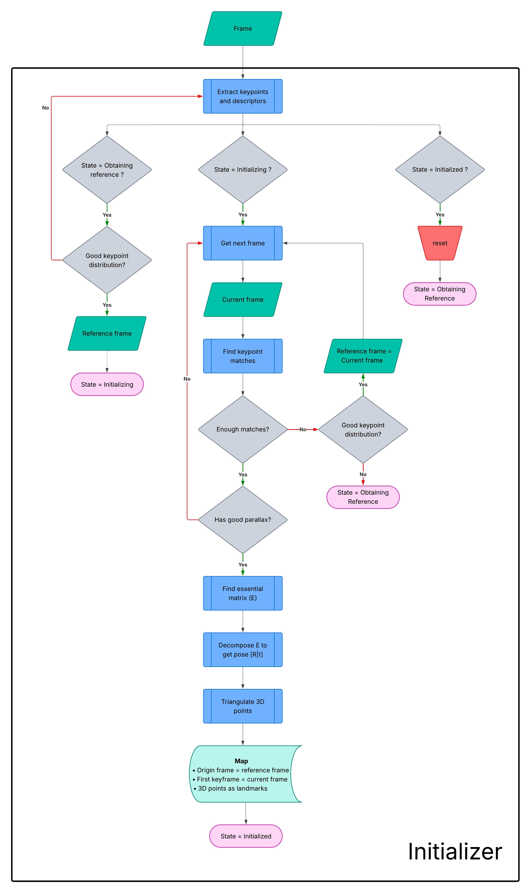
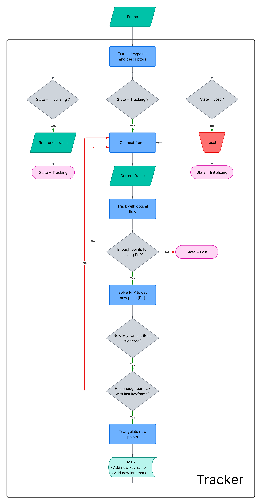

# ros2_mono_vo

A simple monocular visual odometry system for ROS2. This package provides a single node that estimates the 6-DOF pose of a camera from a monocular image stream.

## Prerequisites

- ROS 2 (Tested on Jazzy)
- OpenCV
- A calibrated camera (undistorted) publishing `sensor_msgs/Image` and `sensor_msgs/CameraInfo` messages.

## How to Launch

1.  Build the package:
    ```bash
    colcon build --packages-up-to mono_vo
    ```

2.  Source the workspace:
    ```bash
    source install/setup.bash
    ```

3.  Run the launch file. This will start the VO node and RViz for visualization.
    ```bash
    ros2 launch mono_vo mono_vo.launch.py
    ```

## Subscribed Topics

| Topic | Type | Description |
| :--- | :--- | :--- |
| `/camera/image_rect` | `sensor_msgs::msg::Image` | Rectified camera image used for tracking features. |
| `/camera/camera_info` | `sensor_msgs::msg::CameraInfo` | Camera intrinsic parameters required for projection and triangulation. |

## Published Topics

| Topic | Type | Description |
| :--- | :--- | :--- |
| `/odom` | `nav_msgs::msg::Odometry` | The odometry message containing the estimated 6-DOF pose of the camera in the odometry frame. |
| `/path` | `nav_msgs::msg::Path` | The full estimated trajectory of the camera, useful for visualization in RViz. |
| `/pointcloud` | `sensor_msgs::msg::PointCloud2` | The current 3D map points triangulated from keyframes. |

## Parameters

All parameters are loaded from the `config/vo_params.yaml` file at launch.

### Initializer Parameters

These parameters control the two-view initialization process.

| Parameter | Type | Default | Description |
| :--- | :--- | :--- | :--- |
| `initializer.occupancy_grid_div` | `int` | `50` | Grid size (N) for checking keypoint distribution. |
| `initializer.kp_distribution_thresh`| `double` | `0.5` | Minimum ratio of grid cells that must contain keypoints. |
| `initializer.lowes_distance_ratio` | `double` | `0.7` | Lowe's ratio for feature matching; lower is stricter. |
| `initializer.min_matches_for_init` | `int` | `100` | Minimum matches needed to attempt VO initialization. |
| `initializer.ransac_reproj_thresh` | `double` | `1.0` | RANSAC reprojection threshold (pixels) for H/F model fitting. |
| `initializer.f_inlier_thresh` | `double` | `0.5` | Minimum inlier ratio to accept the Fundamental matrix model. |
| `initializer.model_score_thresh` | `double` | `0.56`| Score ratio (H/F) threshold to decide between planar and general scene models. |

### Tracker Parameters

These parameters control the frame-to-frame tracking and keyframe generation logic.

| Parameter | Type | Default | Description |
| :--- | :--- | :--- | :--- |
| `tracker.tracking_error_thresh` | `double` | `30.0` | Lucas-Kanade (LK) optical flow tracking error threshold in pixels. |
| `tracker.min_observations_before_triangulation` | `int` | `100` | Keyframe trigger: minimum total feature observations required. |
| `tracker.min_tracked_points` | `int` | `10` | Minimum tracked points required; tracking is declared lost if count falls below this. |
| `tracker.max_tracking_after_keyframe` | `int` | `10` | Keyframe trigger: maximum number of frames to track after the last keyframe. |
| `tracker.max_rotation_from_keyframe` | `double` | `0.2618` | Keyframe trigger: maximum rotation from the last keyframe (radians, 15 deg). |
| `tracker.max_translation_from_keyframe` | `double` | `1.0` | Keyframe trigger: maximum translation (meters) from the last keyframe. |
| `tracker.ransac_reproj_thresh` | `double` | `1.0` | RANSAC reprojection threshold (pixels) for estimating pose. |
| `tracker.model_score_thresh` | `double` | `0.85` | H/F model score threshold for robust pose estimation. |
| `tracker.f_inlier_thresh` | `double` | `0.5` | Minimum inlier ratio to accept the Fundamental matrix model for pose estimation. |
| `tracker.lowes_distance_ratio` | `double` | `0.7` | Lowe's ratio for matching new features against the last keyframe. |

## Algorithm

The system follows a classic monocular VO structure, comprising two main stages: **Initialization** and **Tracking**. It is a pure front-end system and does not currently implement backend optimization like Bundle Adjustment (BA) or global map optimization.

### Key Data Structures

*   **`Frame`**: A temporary object containing the raw image, camera pose, and observations (`keypoint`, `descriptor`, `landmark_id`). It's used during initialization and tracking to compute odometry.
*   **`Keyframe`**: A representation of a `Frame` that is permanently stored in the map. To save memory, it only stores the pose and observations, not the raw image. Keyframes are selected based on good parallax and tracking quality to serve as anchors in the map.
*   **`Map`**: The global map of the environment, storing all `Keyframes` and triangulated 3D `Landmarks`.

---

### 1. Initialization

The goal of this stage is to create the initial 3D map from the first two frames, which provides the scale and origin for the rest of the odometry pipeline.

1. Find a frame that has good keypoint distribution to serve as the reference frame.
2. Process incoming frames until a suitable pair is found. A pair is considered "suitable" if it has:
    *   A sufficient number of matched features.
    *   Significant parallax, indicating clear camera motion between the two frames.
3.  Compute the **Essential Matrix (`E`)** from the matched points between the two frames.
4.  Decompose the Essential Matrix to recover the relative **rotation (`R`)** and **translation (`t`)**.
5.  Triangulate the matched features using the computed pose to create the initial set of 3D map points (**Landmarks**).
6.  The first frame is set as the world origin.
7.  Both the first and second frames are added to the `Map` as the first two `Keyframes`.
8.  The newly created 3D points are added to the `Map` as `Landmarks`, establishing the initial map.



---

### 2. Tracking (Main Loop)

Once the map is initialized, the system enters the main tracking loop. For every new frame, the goal is to track existing map points and estimate the camera's current pose.

**For each new incoming frame:**

1.  **Track Features**: Track 2D features from the *last frame* to the *current frame* using the **Lucas-Kanade optical flow** algorithm. This provides a set of 2D-3D correspondences (current 2D points and their associated 3D `Landmarks` from the map).
2.  **Estimate Pose**: Estimate the current camera pose by solving the **Perspective-n-Point (PnP)** problem. This is performed robustly using a **RANSAC** scheme to handle outliers in tracking.
3.  **Keyframe Decision**: After each successful pose estimation, evaluate if the current frame should be a new `Keyframe`. The criteria are:
    *   **Time-based:** A certain number of frames have passed since the last `Keyframe` was inserted.
    *   **Tracking Quality:** The number of tracked points drops below a predefined threshold.
    *   **Motion:** The camera has moved a significant distance or rotated by a significant angle from the last `Keyframe`.
4.  **New Keyframe Creation**: If the decision is positive **and** the frame has sufficient parallax with the last `Keyframe`:
    *   Triangulate new 3D points between the current frame and the last `Keyframe` to expand the map.
    *   Add the new 3D points to the `Map`.
    *   Add the current frame to the `Map` as a new `Keyframe`.
5.  Repeat the process for the next frame.

#### Lost Tracking

The system detects a "lost" state if the number of points successfully tracked via optical flow is critically low (e.g., due to extreme motion or occlusion). Currently, the pipeline halts upon losing track, and there is no re-localization or recovery mechanism.

